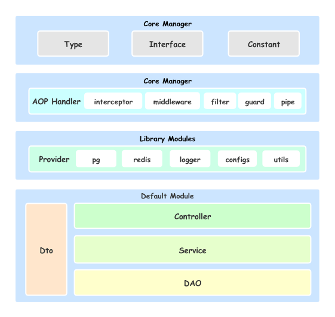

# Nest-Server

> 🚀 probably the best scaffolding for nest.js server-side development

[English Docs](docs/en.md) | [中文文档](docs/cn.md)

## Architecture diagram

## Structure

- **src/**
  - **common/**
    - **types/** (or **.ts**)
    - **interfaces/** (or **.ts**)
    - **constants/** (or **.ts**)
  - **configs/**
    - common.ts
    - config.dev.ts
    - config.test.ts
    - config.pre.ts
    - config.prod.ts
    - interface.ts
    - index.ts
  - **entities/**
    - base.ts
    - index.ts
    - **YOUR ENTITY**.ts
  - **lib/**
    - database.ts
    - logger.ts
    - store.ts
    - redis.ts
    - index.ts
  - **modules/**
    - index.ts
    - module
      - **controller/** (or **.ts**)
      - **service/** (or **.ts**)
      - **dao/** (or **.ts**)
      - **dto/** (or **.ts**)
      - index.ts
  - server.ts
  - main.ts