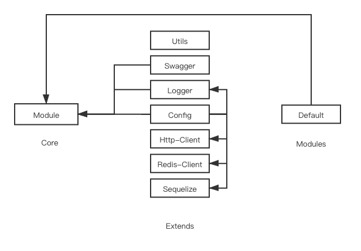

# 📚 框架介绍

## 设计思想

> 目标：📉 降低开发者认知复杂度，📈 提高开发与协作效率。

### 依赖注入/控制反转（`IOC` & `DI` ) 

> 控制反转 `IOC`（Inversion of Control ) 

所谓 `IOC`，对于 `Nest-Server` 来说，就是由 `CoreModule` 来负责控制对象的生命周期和对象间的关系， 这是 `Nest-Server` 的核心，贯穿始终。

这是什么意思呢，举个简单的例子，我们是如何找女朋友的？常见的情况是，我们到处去看哪里有长得漂亮身材又好的mm，然后打听她们的兴趣爱好、qq号、电话号，想办法认识她们，投其所好送其所要，这个过程是复杂深奥的，我们必须自己设计和面对每个环节。传统的程序开发也是如此，在一个对象中，如果要使用另外的对象，就必须得到它（自己 new 一个 ) ，使用完之后还要将对象销毁（比如 Connection 等 ) ，对象始终会和其他的接口或类藕合起来。

那么 `CoreModule` 是如何做的呢？有点像通过婚介找女朋友，在我和女朋友之间引入了一个第三者：婚姻介绍所。婚介管理了很多男男女女的资料，我可以向婚介提出一个列表，告诉它我想找个什么样的女朋友，比如长得像李嘉欣，身材像林熙雷，唱歌像周杰伦，速度像卡洛斯，技术像齐达内之类的，然后婚介就会按照我们的要求，提供一个mm，我们只需要去和她谈恋爱、结婚就行了。简单明了，如果婚介给我们的人选不符合要求，我们就会抛出异常。整个过程不再由我自己控制，而是有婚介这样一个类似容器的机构来控制。`Nest-Server` 所倡导的开发方式就是如此，所有的模块都会在 `CoreModule` 中登记，告诉 `CoreModule` 你是个什么东西，你需要什么东西，然后  `CoreModule` 会在系统运行到适当的时候，把你要的东西主动给你，同时也把你交给其他需要你的东西。

所有的类的创建、销毁都由 `CoreModule` 来控制，也就是说控制对象生存周期的不再是引用它的对象，而是 `CoreModule`  。对于某个具体的对象而言，以前是它控制其他对象，现在是所有对象都被 `CoreModule` 控制，所以这叫控制反转。

> 依赖注入 `DI`（Dependency Injection ) 

`IOC` 的一个重点是在系统运行中，动态的向某个对象提供它所需要的其他对象。这一点是通过`DI`来实现的。

比如对象 A 需要操作数据库，以前我们总是要在 A 中自己编写代码来获得一个 Connection 对象，而现在，我们就只需要告诉 `CoreModule`，A中需要一个 Connection，至于这个 Connection 怎么构造，何时构造，A 不需要知道。在系统运行时， `CoreModule` 会在适当的时候制造一个 Connection，然后像打针一样，注射到 A 当中，这样就完成了对各个对象之间关系的控制。A 需要依赖 Connection 才能正常运行，而这个 Connection 是由 `CoreModule` 注入到 A 中的，依赖注入的名字就这么来的。那么 `DI` 是如何实现的呢？ `Nest-Server` 的一个重要特征就是反射（reflection ) ，它允许程序在运行的时候动态的生成对象、执行对象的方法、改变对象的属性，`CoreModule` 就是通过反射来实现注入的。

理解了 `IOC` 和`DI`的概念后，一切都将变得简单明了，剩下的工作只不过是在 `CoreModule` 中堆积木而已。

### 面向对象编程（`OOP` ) 

> 面向对象编程（Object Oriented Programming，OOP ) 是一种编程思想

面向对象程序设计以对象为核心，该方法认为程序由一系列对象组成。类是对现实世界的抽象，包括表示静态属性的数据和对数据的操作，对象是类的实例化。对象间通过消息传递相互通信，来模拟现实世界中不同实体间的联系。在面向对象的程序设计中，对象是组成程序的基本模块。

> OOP 的本质是为了处理大型复杂系统的设计和实现。OOP的优势一定要到了根本就不可能有一个“上帝视角”的存在，不得不把系统拆成很多 Object 时才会体现出来。

为什么 OOP 能够支撑庞大复杂的系统呢？用开公司举个例子。如果公司就只有几个人，那么大家总是一起干活，工作可以通过“上帝视角“完全搞清楚每一个细节，于是可以制定非常清晰的、明确的流程来完成这个任务。这个思想接近于传统的面向过程编程。而如果公司人数变多，达到几百上千，这种“上帝视角”是完全不可行的。在这样复杂的公司里，没有一个人能搞清楚一个工作的所有细节。为此，公司要分很多个部门，每个部门相对的独立，有自己的章程，办事方法和规则等。独立性就意味着“隐藏内部状态”。比如你只能说申请让某部门按照章程办一件事，却不能说命令部门里的谁谁谁，在什么时候之前一定要办成。这些内部的细节你管不着。类似的，更高一层，公司之间也存在大量的协作关系。一个汽车供应链可能包括几千个企业，组成了一个商业网络。通过这种松散的协作关系维系的系统可以无限扩展下去，形成庞大的，复杂的系统。这就是 OOP 想表达的思想。

### 面向切面编程（`AOP` ) 

> 面向切面编程(Aspect Oriented Programming，AOP ) 是一种编程思想

AOP 使用“横切”的设计，剖解开封装对象的内部，将影响多个类的公共行为封装到一个可重用的模块中，并将其命名为 `Aspect` 切面。所谓的切面，简单来说就是与业务无关，却为业务模块所共同调用的逻辑，将其封装起来便于减少系统的重复代码，降低模块的耦合度，有利用未来的可操作性和可维护性。

> 中间件（洋葱模型) 就是一种经典的 AOP

### 模块化开发

> 模块化是指，解决一个复杂问题时自顶向下逐层把系统划分成若干模块的过程，有多种属性，分别反映其内部特性。

在系统的结构中，模块是可组合、分解和更换的单元。模块化是一种处理复杂系统分解成为更好的可管理模块的方式。它可以通过在不同组件设定不同的功能，把一个问题分解成多个小的独立、互相作用的组件，来处理复杂、大型的软件。

模块化开发的核心在于内聚细节实现，对外提供引用，彼此之间互不影响，每个模块都是实现某一特定的功能。模块化的意义在于最大化的设计重用，以最少的模块、零部件，更快速的满足更多的个性化需求。

#### 可维护性

- 灵活架构，焦点分离
- 方便模块间组合、分解
- 方便单个模块功能调试、升级

#### 可测试性

- 可分单元测试

## 工程结构

### 架构图

### 依赖关系图

### 流程处理图

### 模块职责介绍

> Nest-Server 工程根据职责分为四部分，分别是：

#### Core 核心容器层

- `NestApplication` 将根据 `Module` 核心容器模块内注册的内容，进行依赖管理，并且生成对应的 `Context` 应用上下文。

- `Module` 核心容器模块用于全局 `AOP` 执行器、`Extends` 拓展模块、 `Modules` 业务模块的注册声明。

- `NestApplication` 生成后，我们可以通过 `get` 方法，获取 `Context` 应用上下文中任何注册过的 `AOP` 执行器/`Provider` 提供者。

#### Common 公共约定层

- `constant` 用于存放常量
- `enum` 用于存放枚举值
- `interface` 用于存放接口定义

#### Extends 拓展模块层

> 将外部依赖进行分类，封装成独立的拓展模块

拓展模块对内内聚了 `工具/方法/实例` 的实现方法，对外提供了 Provider 供其他模块/`Context`调用

> 目前 `Nest-Server` 内必须注册的拓展有：

- config 配置模块
- swagger 接口文档模块（open api）
- logger 日志模块

> 可选的拓展有：

- utils
- sequelize
- http-client
- redis-client
- **[待开发的可选拓展](../../README.MD##TODO)**

#### Modules 业务模块层

> 将业务需求进行分类，封装成独立的业务模块

`Nest-Server` 将业务中场景的处理场景进行分层，分别是：

* DTO (Data Transger Object - 数据传输对象)
  * 负责定义外部输入的数据参数定义/类型/校验规则
* Controller (业务逻辑控制层)
  * 定义 Router Path
  * 指定 DTO (输入)
  * 指定 Logic Flow，将业务处理转发到 Service 层，并获取 BO (输出)
* Service (业务逻辑处理层)
  * 对 Mananger 层的调用
  * 对 DAO 层的调用 (简单的 CURD 场景)
  * 当设计复杂业务场景时，应该考虑将 Service 部分处理逻辑下沉为 Manager
* Mananger (业务逻辑组合层)
  * 对 Service 层通用能力的下沉，如调用组合、缓存、事务处理
  * 对 Provider 层的调用，组合返回数据及转化异常信息
  * 与 DAO 层交互，以及对多个 DAO 的组合复用
* DAO (Data Access Object - 数据访问层)
  * 封装 SQL/数据库交互命令 并获取返回值
  * 封装 Extends 模块内 Entity 层的调用 (包含但不限于 sequelize/mongoose)
* Provider (调用提供层)
  * 作为 Client 端对其他 Server 进行 RPC 调用
  * 作为 Client 端对中间件应用进行请求/调用（包括不限于 redis/mq/es）
* BO (Business Object - 业务对象)
  * 负责定义 Service 层对外输出的数据

### 模块通用结构介绍

> 模块化开发，给功能内聚和实现内部特性提供了更多的可能性

#### Common 与 Shared

> 除了全局的公共约定层，每个独立的模块内，都可以拥有自己私有的 `Common` 与 `Shared`

**Common 内部公共约定**

- `base` 用于存放基础类定义
- `constant` 用于存放常量
- `enum` 用于存放枚举值
- `interface` 用于存放接口定义
- `type` 用于存放类型定义

**Shared 内部公共资源**

- 一般用于存放 Entity 定义

#### AOP 执行器

利用 AOP 可以对模块内的各个层级进行隔离，从而使得层级之间的耦合度降低。

##### [* Middleware 中间件](https://docs.nestjs.cn/7/middlewares)

`Nest-Server` 中间件等价于 Express 中间件：

- 在执行过程中，执行代码。
- 对请求和响应对象进行更改。
- 调用堆栈中的下一个中间件函数。
- 如果当前的中间件函数没有结束请求-响应周期，它必须调用 next() 将控制传递给下一个中间件函数。否则, 请求将被挂起。

##### [* Decorator 装饰器](https://docs.nestjs.cn/7/customdecorators)

Nest.js 是基于装饰器这种语言特性而创建的。它是许多常用编程语言中众所周知的概念，但在 JavaScript 世界中，这个概念仍然相对较新。所以为了更好地理解装饰器是如何工作的，你应该看看[这篇文章 📚](https://medium.com/google-developers/exploring-es7-decorators-76ecb65fb841)。下面给出一个简单的定义：

`ES2016` 的装饰器是一个可以将目标对象，名称和属性描述符作为参数的返回函数的表达式。你可以通过装饰器前缀 `@` 来使用它，并将其放置在您想要装饰的最顶端。装饰器可以被定义为一个类或是属性。

##### [* Filter 异常过滤器](https://docs.nestjs.cn/7/exceptionfilters)

内置的异常层负责处理整个应用程序中的所有抛出的异常。当捕获到未处理的异常时，最终用户将收到友好的响应。

##### [* Intercetor 拦截器](https://docs.nestjs.cn/7/interceptors)

拦截器应该实现 `NestInterceptor` 接口。

- 在函数执行之前/之后绑定额外的逻辑
- 转换从函数返回的结果
- 转换从函数抛出的异常
- 扩展基本函数行为
- 根据所选条件完全重写函数 (例如, 缓存目的)

##### [* Pipe 管道](https://docs.nestjs.cn/7/pipes)

管道应实现 `PipeTransform` 接口。

管道有两个类型:

- 转换：管道将输入数据转换为所需的数据输出
- 验证：对输入数据进行验证，如果验证成功继续传递; 验证失败则抛出异常;

在这两种情况下, 管道 参数(arguments) 会由 控制器(controllers)的路由处理程序进行处理。

Nest.js 会在调用这个方法之前插入一个管道，管道会先拦截方法的调用参数，进行转换或是验证处理，然后用转换好或是验证好的参数调用原方法。

##### [* Guard 守卫](https://docs.nestjs.cn/7/guards)

守卫应该实现 `CanActivate` 接口。

守卫有一个单独的责任。它们根据运行时出现的某些条件（例如权限，角色，访问控制列表等）来确定给定的请求是否由路由处理程序处理。 这通常称为授权。在传统的 Express 应用程序中，通常由中间件处理授权。中间件是身份验证的良好选择。到目前为止，访问限制逻辑大多在中间件内。这样很好，因为诸如 token 验证或将 request 对象附加属性与特定路由没有强关联。
