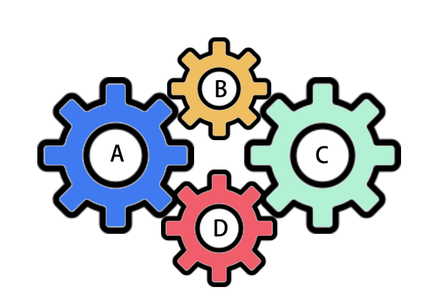
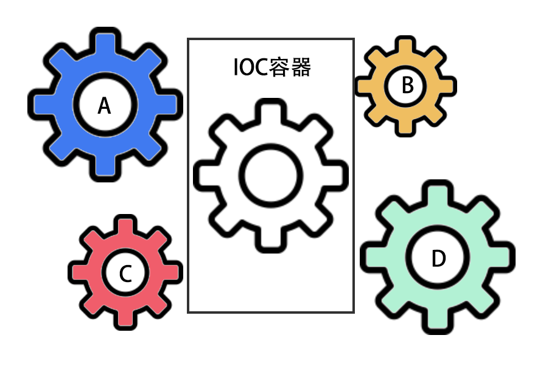
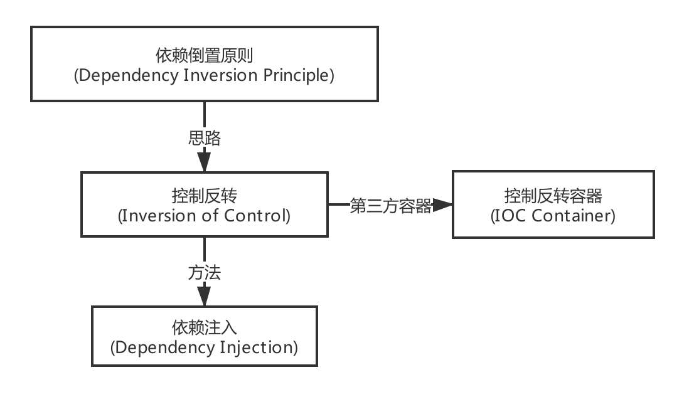
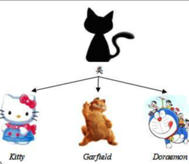
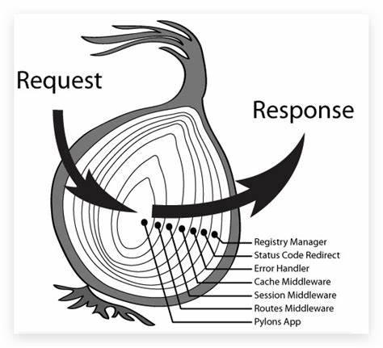
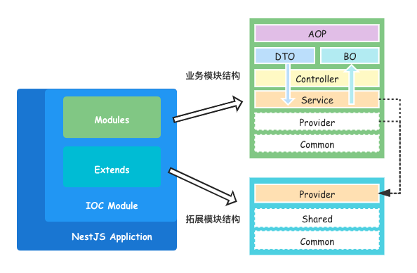

# 📚 框架介绍

## 设计思想

> 目标：📉 降低开发者认知复杂度，📈 提高开发与协作效率。

### 依赖注入/控制反转（`IOC` & `DI`）

> 控制反转 `IOC`（Inversion of Control）

所谓 `IOC`，对于 `Nest-Server` 来说，就是由 `CoreModule` 来负责控制对象的生命周期和对象间的关系， 这是 `Nest-Server` 的核心，贯穿始终。

这是什么意思呢，举个简单的例子，我们是如何找女朋友的？常见的情况是，我们到处去看哪里有长得漂亮身材又好的mm，然后打听她们的兴趣爱好、qq号、电话号，想办法认识她们，投其所好送其所要，这个过程是复杂深奥的，我们必须自己设计和面对每个环节。传统的程序开发也是如此，在一个对象中，如果要使用另外的对象，就必须得到它（自己 new 一个），使用完之后还要将对象销毁（比如 Connection 等），对象始终会和其他的接口或类藕合起来。

那么 `CoreModule` 是如何做的呢？有点像通过婚介找女朋友，在我和女朋友之间引入了一个第三者：婚姻介绍所。婚介管理了很多男男女女的资料，我可以向婚介提出一个列表，告诉它我想找个什么样的女朋友，比如长得像李嘉欣，身材像林熙雷，唱歌像周杰伦，速度像卡洛斯，技术像齐达内之类的，然后婚介就会按照我们的要求，提供一个mm，我们只需要去和她谈恋爱、结婚就行了。简单明了，如果婚介给我们的人选不符合要求，我们就会抛出异常。整个过程不再由我自己控制，而是有婚介这样一个类似容器的机构来控制。`Nest-Server` 所倡导的开发方式就是如此，所有的模块都会在 `CoreModule` 中登记，告诉 `CoreModule` 你是个什么东西，你需要什么东西，然后  `CoreModule` 会在系统运行到适当的时候，把你要的东西主动给你，同时也把你交给其他需要你的东西。

所有的类的创建、销毁都由 `CoreModule` 来控制，也就是说控制对象生存周期的不再是引用它的对象，而是 `CoreModule`  。对于某个具体的对象而言，以前是它控制其他对象，现在是所有对象都被 `CoreModule` 控制，所以这叫控制反转。

> 依赖注入 `DI`（Dependency Injection）

`IOC` 的一个重点是在系统运行中，动态的向某个对象提供它所需要的其他对象。这一点是通过`DI`来实现的。

比如对象 A 需要操作数据库，以前我们总是要在 A 中自己编写代码来获得一个 Connection 对象，而现在，我们就只需要告诉 `CoreModule`，A中需要一个 Connection，至于这个 Connection 怎么构造，何时构造，A 不需要知道。在系统运行时， `CoreModule` 会在适当的时候制造一个 Connection，然后像打针一样，注射到 A 当中，这样就完成了对各个对象之间关系的控制。A 需要依赖 Connection 才能正常运行，而这个 Connection 是由 `CoreModule` 注入到 A 中的，依赖注入的名字就这么来的。那么 `DI` 是如何实现的呢？ `Nest-Server` 的一个重要特征就是反射（reflection），它允许程序在运行的时候动态的生成对象、执行对象的方法、改变对象的属性，`CoreModule` 就是通过反射来实现注入的。

理解了 `IOC` 和`DI`的概念后，一切都将变得简单明了，剩下的工作只不过是在 `CoreModule` 中堆积木而已 😁

### 面向对象编程（OOP）

> 面向对象编程（Object Oriented Programming，OOP）是一种编程思想

面向对象程序设计以对象为核心，该方法认为程序由一系列对象组成。类是对现实世界的抽象，包括表示静态属性的数据和对数据的操作，对象是类的实例化。对象间通过消息传递相互通信，来模拟现实世界中不同实体间的联系。在面向对象的程序设计中，对象是组成程序的基本模块。

> OOP 的本质是为了处理大型复杂系统的设计和实现。OOP的优势一定要到了根本就不可能有一个“上帝视角”的存在，不得不把系统拆成很多 Object 时才会体现出来。

为什么 OOP 能够支撑庞大复杂的系统呢？用开公司举个例子。如果公司就只有几个人，那么大家总是一起干活，工作可以通过“上帝视角“完全搞清楚每一个细节，于是可以制定非常清晰的、明确的流程来完成这个任务。这个思想接近于传统的面向过程编程。而如果公司人数变多，达到几百上千，这种“上帝视角”是完全不可行的。在这样复杂的公司里，没有一个人能搞清楚一个工作的所有细节。为此，公司要分很多个部门，每个部门相对的独立，有自己的章程，办事方法和规则等。独立性就意味着“隐藏内部状态”。比如你只能说申请让某部门按照章程办一件事，却不能说命令部门里的谁谁谁，在什么时候之前一定要办成。这些内部的细节你管不着。类似的，更高一层，公司之间也存在大量的协作关系。一个汽车供应链可能包括几千个企业，组成了一个商业网络。通过这种松散的协作关系维系的系统可以无限扩展下去，形成庞大的，复杂的系统。这就是 OOP 想表达的思想。

### 面向切面编程（AOP）

> 面向切面编程(Aspect Oriented Programming，AOP）是一种编程思想

AOP 技术利用一种称为“横切”的技术，剖解开封装对象的内部，将影响多个类的公共行为封装到一个可重用的模块中，并将其命名为 `Aspect` 切面。所谓的切面，简单来说就是与业务无关，却为业务模块所共同调用的逻辑，将其封装起来便于减少系统的重复代码，降低模块的耦合度，有利用未来的可操作性和可维护性。

> 中间件（洋葱模型）就是一种经典的面向切面技术

### 模块化开发

## 架构

### 架构图

> 从功能上来看，``Nest-Server`` 的整体能力可以划分为四层：

- Common 全局公用约定目录
- `CoreModule` 核心 `IOC` 容器 & 启动程序
- Extends 拓展模块
- Modules 业务模块

